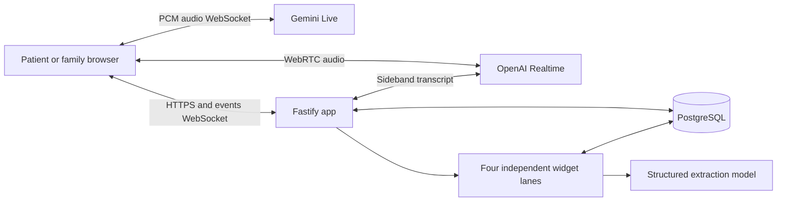

# Harbor — a voice care navigator

Live demo: https://harbor-web-production-9d86.up.railway.app

Harbor is a patient- and family-facing AI voice navigator. It listens through a browser call, keeps a persistent transcript, and updates four independent live views: the care circle, care timeline, needs and questions, and next steps. Each extracted detail links to the turn that supports it. A person can correct a detail, review what changed over the session, or delete the conversation.

Harbor is **non-clinical**. It does not diagnose, advise medication changes, or claim that appointments, rides, or follow-ups were arranged. The interface identifies it as AI. Use fictional or de-identified information for a demo; this prototype is not a production clinical record system.

## What to try

1. Choose **Family or caregiver** or **Patient**, choose OpenAI or Gemini under **Voice service**, then adjust tone, pace, focus, and voice. Both providers use the same persona, transcript, persistence, correction, and widget pipeline.
2. Start a call, mention a person, an appointment, a practical barrier, and an action you intend to take. Open **Live workspace** while speaking to see four independently updating views.
3. Say that one of those details was wrong. Check the new source-linked item and the replay timeline. End the call, reload the page, and reopen it from **Conversations**.
4. If you want to inspect the interface without using voice, select **Explore a fictional sample conversation**. Its Thursday correction and unconfirmed ride show how uncertainty and changes are represented. The sample is scripted and explicitly separate from a live call.

| Prompt level | Implemented evidence |
| --- | --- |
| Level 1 | Start/end a WebRTC voice call; save finalized user and assistant turns, settings, and history in PostgreSQL/PGlite. |
| Level 2 | Live transcript and widget status through a visitor-scoped WebSocket; configurable caller mode, tone, pace, focus, and voice. |
| Level 3 | Four independently scheduled, persisted widget jobs with per-widget status, timing, source quotes, correction history, and event replay. |



## Run locally

Requires Node 22+. Add `OPENAI_API_KEY` for OpenAI WebRTC voice, `GEMINI_API_KEY` for Gemini Live voice, or both. `DATABASE_URL` is optional locally: without it, data persists in `./data` using PGlite. With it, Harbor uses PostgreSQL.

```bash
npm ci
cp .env.example .env
# Set OPENAI_API_KEY in .env; optionally set DATABASE_URL
npm run dev
```

Open `http://localhost:3000`. Without a configured provider key, **Open text sandbox** lets you inspect persistence and widgets, but there is no simulated voice agent. Microphone access requires a secure origin (localhost or HTTPS). Provider keys remain server-side. Gemini’s free tier may use submitted content to improve Google products, so use fictional demo details with it.

## Deploy

The included Dockerfile runs the production Vite build and Fastify server on `$PORT`. Set `OPENAI_API_KEY` and a managed PostgreSQL `DATABASE_URL` in the hosting provider. Use one application instance for this prototype; live WebSocket subscribers and worker scheduling are process-local. Database TLS defaults off for private service networks; set `PGSSL=require` for an external PostgreSQL endpoint that requires TLS. Do not deploy with PGlite unless the host provides persistent storage.

On Railway, create a service from this repository, add a PostgreSQL service, map its connection string to `DATABASE_URL`, add either or both provider keys, and use the generated public domain. The health endpoint is `/api/health`. A visitor can make up to eight voice calls in 24 hours; calls end after ten minutes, and the app caps active voice sessions at four. These are demo cost controls.

## How it works

- React client uses WebRTC for the browser-to-OpenAI Realtime audio call. Fastify creates the call using the server-held API key and attaches a server-side monitoring WebSocket for finalized transcripts. The Gemini option uses a server-side Gemini Live WebSocket and a browser AudioWorklet: the browser sends 16 kHz PCM and receives 24 kHz PCM while the server saves Gemini input/output transcriptions through the same Store.
- A user turn, its event, and four analysis jobs are committed in one database transaction. Four widget lanes process each turn independently using structured model output; each job validates its source quote before saving a fact. The keyless text sandbox uses lightweight rule extraction for local inspection.
- PostgreSQL/PGlite store visitors, conversations, turns, facts, widget states, events, and jobs. A random HttpOnly visitor cookie scopes access. This is convenient for a demo, not a replacement for production authentication.
- Corrections preserve the original item as corrected, write a replacement linked to it, and reprocess all widgets. The replay slider reads persisted events. Deletion cascades through all conversation data.

## Checks

```bash
npm run build
npm test
node --import tsx tests/browser-smoke.ts # while local server runs
```

The automated checks cover stored turn/job atomicity, duplicate provider events, visitor isolation, correction history, cascading deletion, and a browser flow. A live voice call requires an OpenAI key and a browser microphone; verify it manually on the deployed URL before sharing the demo. The current verification record is in [docs/EVALUATION.md](docs/EVALUATION.md).

## Current limitations

This is an interview prototype. It has no account recovery, clinician workflow, formal audit/retention policy, multi-instance event fanout, or HIPAA-ready operating controls. Browser identity is tied to a cookie. Live voice and model extraction require a configured provider account. The text sandbox is for testing persistence and widget behavior; it does not converse.
